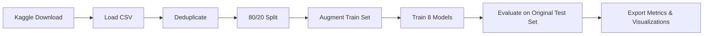

# Heart Disease Prediction

A Flask-based web application that predicts the presence of heart disease using **8 machine learning models**. Users input 13 clinical features through an intuitive form and receive instant predictions from any chosen model, along with performance metrics and confidence indicators.

**Main Contributor:** Abhiraj Ghose | Roll Number: E23CSEU0014 | Bennett University

---

## Table of Contents

- [Overview](#overview)
- [Tech Stack](#tech-stack)
- [Dataset](#dataset)
- [Models & Performance](#models--performance)
- [Web Application Features](#web-application-features)
- [Training Pipeline](#training-pipeline)
- [Project Structure](#project-structure)
- [Getting Started](#getting-started)
- [Deployment](#deployment)
- [Contributor](#contributor)

---

## Overview

This project implements a complete end-to-end machine learning pipeline for heart disease prediction:

- **Data pipeline:** Automated download, deduplication, augmentation, and train/test splitting
- **8 ML models:** Logistic Regression, Naive Bayes, SVM, KNN, Decision Tree, Random Forest, XGBoost, and Neural Network
- **Web interface:** Flask-based UI with individual clinical input fields, a model selector, and real-time predictions
- **Results dashboard:** Interactive `/models` route with comparison tables, line charts, bar charts, and confusion matrices
- **Deployment ready:** Pre-configured for Vercel with minimal production dependencies

---

## Tech Stack

| Layer | Technology |
|-------|------------|
| **Backend** | Python 3.12+, Flask, Gunicorn |
| **ML / Training** | scikit-learn, XGBoost, joblib |
| **Data** | pandas, NumPy, kagglehub |
| **Visualization** | Matplotlib, Seaborn |
| **Frontend** | HTML, Tailwind CSS (CDN), Inter Font |
| **Deployment** | Vercel (`vercel.json`) |
| **Debugging** | VS Code (`launch.json`) |

---

## Dataset

The dataset is automatically downloaded from Kaggle via `kagglehub` when `train.py` is executed.

- **Source:** [UCI Heart Disease Dataset](https://www.kaggle.com/datasets/johnsmith88/heart-disease-dataset) (aggregated from Cleveland, Hungarian, Swiss, and Long Beach VA)
- **Raw:** 1,025 rows (723 are exact duplicates from overlapping UCI sources)
- **After deduplication:** 302 unique patient records
- **After augmentation:** ~1,000 rows (original + synthetic variations via controlled noise injection)
- **Train/Test split:** 80/20 stratified on original unique data (241 train, 61 test)
- **Test set integrity:** Only original (non-augmented) records used for evaluation

### Features

| # | Feature | Type | Description |
|---|---------|------|-------------|
| 1 | `age` | Continuous | Age in years |
| 2 | `sex` | Binary | 1 = male, 0 = female |
| 3 | `cp` | Ordinal | Chest pain type (1: typical angina, 2: atypical angina, 3: non-anginal pain, 4: asymptomatic) |
| 4 | `trestbps` | Continuous | Resting blood pressure (mm Hg) |
| 5 | `chol` | Continuous | Serum cholesterol (mg/dl) |
| 6 | `fbs` | Binary | Fasting blood sugar > 120 mg/dl (1 = true, 0 = false) |
| 7 | `restecg` | Ordinal | Resting ECG results (0: normal, 1: ST-T wave abnormality, 2: left ventricular hypertrophy) |
| 8 | `thalach` | Continuous | Maximum heart rate achieved |
| 9 | `exang` | Binary | Exercise induced angina (1 = yes, 0 = no) |
| 10 | `oldpeak` | Continuous | ST depression induced by exercise relative to rest |
| 11 | `slope` | Ordinal | ST segment slope (0: upsloping, 1: flat, 2: downsloping) |
| 12 | `ca` | Ordinal | Number of major vessels colored by fluoroscopy (0-4) |
| 13 | `thal` | Nominal | Thalassemia (3: normal, 6: fixed defect, 7: reversible defect) |
| **Target** | `target` | Binary | 0 = no heart disease, 1 = heart disease present |

---

## Models & Performance

All models trained on augmented data (1,000 rows) and evaluated on the original held-out test set (61 records). Neural Network leads across most metrics.

| Model | Accuracy | Precision | Recall | F1-Score | ROC-AUC | Specificity |
|-------|----------|-----------|--------|----------|---------|-------------|
| **Neural Network (MLP)** | **86.89%** | **86.84%** | **91.67%** | **89.19%** | **93.67%** | 80.00% |
| Support Vector Machine | 83.61% | 84.21% | 88.89% | 86.49% | 88.67% | 76.00% |
| Random Forest | 83.61% | 84.21% | 88.89% | 86.49% | 90.61% | 76.00% |
| XGBoost | 83.61% | 86.11% | 86.11% | 86.11% | 90.22% | 80.00% |
| Logistic Regression | 81.97% | 82.05% | 88.89% | 85.33% | 88.33% | 72.00% |
| Decision Tree | 81.97% | 79.07% | 94.44% | 86.08% | 79.22% | 64.00% |
| Naive Bayes | 80.33% | 81.58% | 86.11% | 83.78% | 88.67% | 72.00% |
| K-Nearest Neighbors | 55.74% | 61.54% | 66.67% | 64.00% | 57.00% | 40.00% |

### Model Details

| Model | Algorithm | Library | Key Hyperparameters |
|-------|-----------|---------|-------------------|
| Logistic Regression | LogisticRegression | scikit-learn | Default |
| Naive Bayes | GaussianNB | scikit-learn | Default |
| SVM | SVC (linear kernel, probability=True) | scikit-learn | `kernel='linear'` |
| KNN | KNeighborsClassifier | scikit-learn | `n_neighbors=7` |
| Decision Tree | DecisionTreeClassifier | scikit-learn | `random_state=42` |
| Random Forest | RandomForestClassifier | scikit-learn | `random_state=42` |
| XGBoost | XGBClassifier | xgboost | `objective="binary:logistic"`, `random_state=42` |
| Neural Network | MLPClassifier | scikit-learn | `hidden_layer_sizes=(11,)`, `activation='relu'`, `solver='adam'`, `max_iter=300` |

---

## Web Application Features

### Diagnostic Engine (`/`)

- 13 individual form fields, one per clinical feature
- Dropdown selector to choose among all 8 trained models
- **Generate Random Data** button for quick testing
- Prediction result displayed with:
  - Color-coded banner (red = heart disease, green = no disease)
  - Probability/raw output
  - Model performance badges (accuracy, precision, recall, F1, ROC-AUC)
- Input validation with descriptive error messages

### Model Benchmarks (`/models`)

- Full comparison table with all 6 metrics across all 8 models
- Three visualization panels:
  - **Line chart:** Models tracked across all metrics
  - **Bar chart:** Grouped comparison per metric
  - **Confusion matrices:** 8-panel grid, one per model

### Pre-trained Models (`models/`)

| File | Model |
|------|-------|
| `logistic_regression_model.pkl` | Logistic Regression |
| `naive_bayes_model.pkl` | Gaussian Naive Bayes |
| `support_vector_machine_model.pkl` | SVM (linear kernel) |
| `k_nearest_neighbors_model.pkl` | K-Nearest Neighbors (k=7) |
| `decision_tree_model.pkl` | Decision Tree |
| `random_forest_model.pkl` | Random Forest |
| `xgboost_model.pkl` | XGBoost |
| `neural_network_model.pkl` | MLP Neural Network |

---

## Training Pipeline

The training script (`train.py`) automates the entire ML workflow:



### Step-by-step

1. **Download** dataset from Kaggle via `kagglehub` → saves to `data/heart.csv`
2. **Load & inspect** — 1,025 rows, 14 columns (13 features + target)
3. **Deduplicate** — removes 723 duplicate rows, keeping 302 unique records
4. **Stratified split** — 80/20 split (241 train, 61 test), test kept fully original
5. **Augment training set** to 1,000 rows using controlled synthetic data generation:
   - **Continuous features** (age, trestbps, chol, thalach, oldpeak): Gaussian noise at 10% of feature standard deviation, clipped to observed data bounds
   - **Binary features** (sex, fbs, exang): Flipped with 10% probability
   - **Ordinal features** (cp, restecg, slope, ca): Shifted ±1 with 15% probability, clipped to valid range
   - **Nominal features** (thal): Swapped to another valid value with 10% probability
   - Final dedup ensures no duplicate rows after augmentation
6. **Train** 7 scikit-learn models + 1 XGBoost model on augmented data
7. **Evaluate** each model on the original test set computing: accuracy, precision, recall, F1-score, ROC-AUC, specificity, and confusion matrix
8. **Export** comparison CSV, line chart, grouped bar chart, and 8-panel confusion matrix grid to `static/results/`
9. **Serialize** all 8 trained models to `models/` as `.pkl` files using `joblib`

---

## Project Structure

```
HeartDiseasePrediction/
├── app.py                          # Flask web application
│                                   #   GET/POST /     → prediction form
│                                   #   GET     /models → benchmark dashboard
├── train.py                        # Full training pipeline
├── requirements.txt                # Production dependencies
├── vercel.json                     # Vercel deployment configuration
├── .python-version                 # Python version (3.12)
├── .gitattributes                  # Git LFS and line-ending settings
├── .gitignore                      # Git ignore rules
├── README.md                       # This file
│
├── templates/
│   ├── index.html                  # Diagnostic engine (prediction form)
│   └── models.html                 # Model benchmark dashboard
│
├── static/
│   └── results/                    # Generated during training
│       ├── comparison.csv          # Full metrics table
│       ├── comparison_line.png     # Multi-line chart
│       ├── comparison_bar.png      # Grouped bar chart
│       └── confusion_matrices.png  # 8-panel confusion matrix grid
│
├── models/                         # Pre-trained model files (.pkl)
│   ├── logistic_regression_model.pkl
│   ├── naive_bayes_model.pkl
│   ├── support_vector_machine_model.pkl
│   ├── k_nearest_neighbors_model.pkl
│   ├── decision_tree_model.pkl
│   ├── random_forest_model.pkl
│   ├── xgboost_model.pkl
│   └── neural_network_model.pkl
│
├── data/                           # Dataset cache (gitignored)
│   └── heart.csv
│
├── flaskvenv/                      # Python virtual environment (gitignored)
│
└── .vscode/
    └── launch.json                 # VS Code debug configurations
```

---

## Getting Started

### Prerequisites

- Python 3.9 or higher (recommended: 3.12)
- pip
- Kaggle API key (for `kagglehub` — place `kaggle.json` in `~/.kaggle/`)

### 1. Clone & Setup

```bash
git clone https://github.com/AetherSparks/Heart_Disease_Prediction.git
cd Heart_Disease_Prediction
python -m venv venv

# Windows:
venv\Scripts\activate
# macOS/Linux:
source venv/bin/activate

pip install -r requirements.txt
```

### 2. Train Models (Optional — Pre-trained Models Included)

Skip this step if you want to use the pre-trained models already in `models/`.

```bash
pip install xgboost matplotlib seaborn kagglehub tqdm
python train.py
```

This will download the dataset, deduplicate, augment, train all 8 models, and export results to `static/results/`.

### 3. Run the Web App

```bash
python app.py
```

- Open **http://127.0.0.1:5000** — fill in the 13 clinical fields (or click **Generate Random Data**), select a model, and predict
- Visit **http://127.0.0.1:5000/models** — view the full model comparison dashboard

### 4. VS Code Debugging

Three launch configurations are provided in `.vscode/launch.json`:

| Configuration | Purpose |
|---------------|---------|
| **Run Flask App** | Debug `app.py` with Jinja template support |
| **Run Train Script** | Debug `train.py` |
| **Current File** | Debug any open Python file |

Press `F5` to start debugging with the selected configuration.

---

## Deployment

### Option 1: Vercel (Recommended)

Pre-configured via `vercel.json`. Serves predictions from pre-trained models.

1. Push to GitHub:
   ```bash
   git push -u origin main
   ```
2. Go to [vercel.com/new](https://vercel.com/new) and import your repository
3. Vercel auto-detects Flask — deploy with zero configuration
4. Environment variable `PYTHON_VERSION=3.12` auto-detected from `.python-version`

**Limits:** Bundle size cap of 500MB. Our production dependencies are ~200MB (well within limit). Cold starts are 1-3s on Fluid compute. Heavy ML dependencies (TensorFlow/PyTorch) are intentionally excluded to stay within free-tier limits.

### Option 2: PythonAnywhere (Free, Always-On)

Better suited for ML apps as it never sleeps.

1. Create an account at [pythonanywhere.com](https://www.pythonanywhere.com)
2. Open a Bash console and clone the repository
3. Create a virtualenv, install dependencies, upload the `models/` folder
4. Set up a Web app → Manual configuration → Python/Flask → Point WSGI at `app.py`

**Limits:** 100 CPU-seconds/day, 512MB storage. Suitable for lightweight usage.

### Option 3: Render (Free, Spins Down After Inactivity)

1. Push to GitHub
2. Go to [render.com](https://render.com) → New Web Service
3. Connect repository, set start command: `gunicorn app:app`
4. Free tier spins down after 15 minutes of inactivity (30-50s cold start)

---

## Contributor

**Abhiraj Ghose**  
Roll Number: E23CSEU0014  
Bennett University  
School of Computer Science Engineering and Technology
