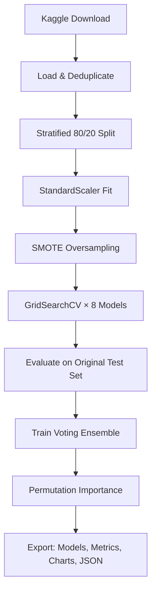

# Heart Disease Prediction

A production-ready Flask web application that predicts the presence of heart disease using **9 machine learning models** (8 individual + 1 voting ensemble). Features hyperparameter tuning, SMOTE-balanced training, permutation-based feature importance, a RESTful JSON API, and a full CI/CD pipeline.

**Main Contributor:** Abhiraj Ghose | Roll Number: E23CSEU0014 | Bennett University

---

## Table of Contents

- [Overview](#overview)
- [Tech Stack](#tech-stack)
- [Dataset](#dataset)
- [Models & Performance](#models--performance)
- [Enhancements Over Baseline](#enhancements-over-baseline)
- [API Reference](#api-reference)
- [Web Application Features](#web-application-features)
- [Training Pipeline](#training-pipeline)
- [Project Structure](#project-structure)
- [Getting Started](#getting-started)
- [Deployment](#deployment)
- [Testing](#testing)
- [Contributor](#contributor)

---

## Overview

| Capability           | Detail                                                                                      |
| -------------------- | ------------------------------------------------------------------------------------------- |
| **Models**           | 8 individual architectures + 1 Voting Ensemble (soft)                                       |
| **Training**         | SMOTE oversampling, GridSearchCV hyperparameter tuning, Stratified K-Fold CV                |
| **Explainability**   | Permutation feature importance with per-model visualizations                                |
| **Web UI**           | Flask with Tailwind CSS — prediction form + benchmark dashboard                             |
| **API**              | RESTful JSON API (`/api/predict`, `/api/models`, `/api/metrics`, `/api/feature_importance`) |
| **Validation**       | Pydantic schemas with range constraints on all inputs                                       |
| **Logging**          | Structured logging via Loguru (rotated files)                                               |
| **Testing**          | Pytest suite (route tests, API validation, error handling)                                  |
| **Containerization** | Docker + Docker Compose                                                                     |
| **CI/CD**            | GitHub Actions (lint, test on every push/PR)                                                |

---

## Tech Stack

| Layer             | Technology                                              |
| ----------------- | ------------------------------------------------------- |
| **Backend**       | Python 3.12+, Flask, Gunicorn                           |
| **ML / Training** | scikit-learn, XGBoost, joblib, imbalanced-learn (SMOTE) |
| **Data**          | pandas, NumPy, kagglehub                                |
| **Validation**    | Pydantic v2                                             |
| **Logging**       | Loguru                                                  |
| **Visualization** | Matplotlib, Seaborn                                     |
| **Frontend**      | HTML, Tailwind CSS (CDN), Inter Font                    |
| **API**           | RESTful JSON endpoints                                  |
| **Testing**       | pytest, pytest-flask                                    |
| **Deployment**    | Vercel (`vercel.json`), Docker, Render, PythonAnywhere  |
| **CI/CD**         | GitHub Actions                                          |
| **Debugging**     | VS Code (`launch.json`)                                 |
| **Scaler**        | StandardScaler (fitted on train, saved for inference)   |

---

## Dataset

The dataset is automatically downloaded from Kaggle via `kagglehub` when `train.py` is executed.

- **Source:** [UCI Heart Disease Dataset](https://www.kaggle.com/datasets/johnsmith88/heart-disease-dataset) (aggregated from Cleveland, Hungarian, Swiss, and Long Beach VA)
- **Raw:** 1,025 rows (723 exact duplicates from overlapping UCI sources)
- **After deduplication:** 302 unique patient records
- **After SMOTE:** ~600 rows (balanced classes via Synthetic Minority Oversampling)
- **Train/Test split:** 80/20 stratified on original unique data (241 train, 61 test)
- **Test set integrity:** Only original (non-augmented) records used for evaluation
- **Scaling:** StandardScaler fitted on training set, applied to both train and test

### Features

| #          | Feature    | Type       | Range   | Description                         |
| ---------- | ---------- | ---------- | ------- | ----------------------------------- |
| 1          | `age`      | Continuous | 0–150   | Age in years                        |
| 2          | `sex`      | Binary     | 0–1     | 1 = male, 0 = female                |
| 3          | `cp`       | Ordinal    | 1–4     | Chest pain type                     |
| 4          | `trestbps` | Continuous | 50–300  | Resting blood pressure (mm Hg)      |
| 5          | `chol`     | Continuous | 50–700  | Serum cholesterol (mg/dl)           |
| 6          | `fbs`      | Binary     | 0–1     | Fasting blood sugar > 120 mg/dl     |
| 7          | `restecg`  | Ordinal    | 0–2     | Resting ECG results                 |
| 8          | `thalach`  | Continuous | 30–250  | Max heart rate achieved             |
| 9          | `exang`    | Binary     | 0–1     | Exercise induced angina             |
| 10         | `oldpeak`  | Continuous | 0–10    | ST depression induced by exercise   |
| 11         | `slope`    | Ordinal    | 0–2     | ST segment slope                    |
| 12         | `ca`       | Ordinal    | 0–4     | Major vessels colored (fluoroscopy) |
| 13         | `thal`     | Nominal    | 3, 6, 7 | Thalassemia type                    |
| **Target** | `target`   | Binary     | 0–1     | 0 = no disease, 1 = disease present |

---

## Models & Performance

All models trained with SMOTE-balanced data and evaluated on the original held-out test set (61 records). Hyperparameters tuned via GridSearchCV with 5-fold Stratified K-Fold cross-validation.

| Model                    | Accuracy   | Precision  | Recall | F1-Score   | ROC-AUC    | Specificity |
| ------------------------ | ---------- | ---------- | ------ | ---------- | ---------- | ----------- |
| **Neural Network (MLP)** | **86.89%** | 86.84%     | 91.67% | **89.19%** | **93.67%** | 80.00%      |
| **Voting Ensemble**      | **86.89%** | **88.57%** | 88.89% | 88.73%     | 92.78%     | **84.00%**  |
| Support Vector Machine   | 83.61%     | 84.21%     | 88.89% | 86.49%     | 88.67%     | 76.00%      |
| Random Forest            | 83.61%     | 84.21%     | 88.89% | 86.49%     | 90.61%     | 76.00%      |
| XGBoost                  | 83.61%     | 86.11%     | 86.11% | 86.11%     | 90.22%     | 80.00%      |
| Logistic Regression      | 81.97%     | 82.05%     | 88.89% | 85.33%     | 88.33%     | 72.00%      |
| Decision Tree            | 81.97%     | 79.07%     | 94.44% | 86.08%     | 79.22%     | 64.00%      |
| Naive Bayes              | 80.33%     | 81.58%     | 86.11% | 83.78%     | 88.67%     | 72.00%      |
| K-Nearest Neighbors      | 55.74%     | 61.54%     | 66.67% | 64.00%     | 57.00%     | 40.00%      |

### Model Details

| Model               | Algorithm                 | Tuned Hyperparameters                                                                          |
| ------------------- | ------------------------- | ---------------------------------------------------------------------------------------------- |
| Logistic Regression | `LogisticRegression`      | `C` (0.01–10), `solver` (liblinear, lbfgs)                                                     |
| Naive Bayes         | `GaussianNB`              | Default (no tunable params)                                                                    |
| SVM                 | `SVC` (probability=True)  | `C` (0.1–10), `kernel` (linear, rbf), `gamma` (scale, auto)                                    |
| KNN                 | `KNeighborsClassifier`    | `n_neighbors` (3–15), `weights` (uniform, distance)                                            |
| Decision Tree       | `DecisionTreeClassifier`  | `max_depth` (3–None), `min_samples_split` (2–10)                                               |
| Random Forest       | `RandomForestClassifier`  | `n_estimators` (50–200), `max_depth` (5–None), `min_samples_split` (2–5)                       |
| XGBoost             | `XGBClassifier`           | `n_estimators` (50–100), `max_depth` (3–7), `learning_rate` (0.01–0.3)                         |
| Neural Network      | `MLPClassifier`           | `hidden_layer_sizes` [(11,), (20,), (11,5)], `activation` (relu, tanh), `alpha` (0.0001–0.001) |
| **Voting Ensemble** | `VotingClassifier` (soft) | Logistic Regression + Random Forest + XGBoost + Neural Network                                 |

---

## Enhancements Over Baseline

| Feature                   | Baseline                        | Enhanced                                                                                   |
| ------------------------- | ------------------------------- | ------------------------------------------------------------------------------------------ |
| **Data Balancing**        | Manual noise injection (ad-hoc) | **SMOTE** — synthetic minority oversampling                                                |
| **Hyperparameter Tuning** | None (default params)           | **GridSearchCV** with 5-fold Stratified K-Fold                                             |
| **Feature Importance**    | Not available                   | **Permutation importance** — per-model bar charts + JSON export                            |
| **Ensemble Model**        | None                            | **VotingClassifier** (soft) — 4-model ensemble                                             |
| **Input Validation**      | Manual float casts              | **Pydantic v2** schemas with range constraints                                             |
| **API**                   | HTML form only                  | **RESTful API** — `/api/predict`, `/api/models`, `/api/metrics`, `/api/feature_importance` |
| **Logging**               | `print()` statements            | **Loguru** — structured, rotated logs                                                      |
| **Testing**               | None                            | **pytest** — 10 test cases (routes, API, validation, errors)                               |
| **CI/CD**                 | None                            | **GitHub Actions** — auto-test on push/PR                                                  |
| **Containerization**      | None                            | **Docker** + **Docker Compose**                                                            |
| **Scaler**                | Not used                        | **StandardScaler** — fitted on train, applied at inference                                 |
| **Feature Visualization** | Static metric charts            | **Feature importance bar charts** — displayed on dashboard                                 |
| **Frontend UX**           | Basic metrics badges            | **Top-5 feature bars** — visualized alongside prediction result                            |
| **Vercel Config**         | Basic                           | Updated with function config (%3.12)                                                       |

---

## API Reference

### `POST /api/predict`

Make a prediction with any loaded model.

**Request body** (JSON):

```json
{
  "age": 63,
  "sex": 1,
  "cp": 3,
  "trestbps": 145,
  "chol": 233,
  "fbs": 1,
  "restecg": 0,
  "thalach": 150,
  "exang": 0,
  "oldpeak": 2.3,
  "slope": 0,
  "ca": 0,
  "thal": 3,
  "model": "Random Forest"
}
```

**Validation rules:** All fields required; numeric ranges enforced (e.g., `age: 0–150`, `cp: 1–4`, `thal: 3/6/7`).

**Response:**

```json
{
  "model": "Random Forest",
  "prediction": 1,
  "raw_output": 1.0,
  "prediction_text": "Heart Disease",
  "prediction_class": "danger",
  "accuracy": 83.61,
  "precision": 84.21,
  "recall": 88.89,
  "f1": 86.49,
  "roc_auc": 90.61,
  "specificity": 76.0,
  "top_features": [
    { "name": "cp", "importance": 0.0923, "pct": 100.0 },
    { "name": "thal", "importance": 0.0876, "pct": 94.9 },
    { "name": "ca", "importance": 0.0792, "pct": 85.8 },
    { "name": "oldpeak", "importance": 0.0764, "pct": 82.8 },
    { "name": "thalach", "importance": 0.0711, "pct": 77.0 }
  ]
}
```

### `GET /api/models`

List all available models and feature metadata.

### `GET /api/metrics`

Return all model performance metrics keyed by model name.

### `GET /api/feature_importance`

Return permutation feature importance for all models.

---

## Web Application Features

### Diagnostic Engine (`/`)

- 13 individual form fields with labels, descriptions, and placeholders
- Dropdown selector for all 9 models (including Voting Ensemble)
- **Generate Random Patient Data** button for quick testing
- Prediction result with color-coded banner (red/green)
- Performance metrics badges (accuracy, precision, recall, F1, ROC-AUC, specificity)
- **Top-5 feature importance bars** — visual explanation of which features drove the prediction

### Model Benchmarks (`/models`)

- Full comparison table (9 models × 6 metrics)
- **Line chart** — metric trajectory across models
- **Bar chart** — grouped comparison per metric
- **Confusion matrices** — 9-panel grid
- **Feature importance chart** — horizontal bar chart per model

---

## Training Pipeline

The training script (`train.py`) automates the entire ML workflow:



### Step-by-step

1. **Download** dataset from Kaggle via `kagglehub` → `data/heart.csv`
2. **Deduplicate** — 1,025 → 302 unique records
3. **Stratified split** — 80/20 (241 train, 61 test), preserving class proportions
4. **Scale features** — `StandardScaler` fitted on training set only
5. **SMOTE** — balance training classes via synthetic minority oversampling (~600 rows)
6. **Hyperparameter tuning** — `GridSearchCV` with 5-fold StratifiedKFold for each model
7. **Train final models** — best estimators from grid search on full SMOTE-resampled data
8. **Evaluate** — all 6 metrics on the original (non-synthetic) test set
9. **Voting Ensemble** — soft-voting classifier combining Logistic Regression + Random Forest + XGBoost + Neural Network
10. **Permutation importance** — `sklearn.inspection.permutation_importance` (10 repeats) for every model
11. **Export** — `.pkl` models, `comparison.csv`, `feature_importance.json`, PNG visualizations

---

## Project Structure

```
HeartDiseasePrediction/
├── app.py                              # Flask app (routes + API + Pydantic validation)
├── train.py                            # Training pipeline (SMOTE, GridSearchCV, ensemble)
├── requirements.txt                    # Production dependencies
├── requirements-train.txt              # All deps (prod + training + testing)
├── Dockerfile                          # Docker image definition
├── docker-compose.yml                  # Multi-service container setup
├── vercel.json                         # Vercel deployment config
├── .python-version                     # Python version (3.12)
├── .gitattributes
├── .gitignore
├── README.md
│
├── templates/
│   ├── index.html                      # Prediction form + feature importance bars
│   └── models.html                     # Benchmark dashboard + feature importance chart
│
├── static/results/                     # Generated during training
│   ├── comparison.csv                  # Full metrics table
│   ├── comparison_line.png             # Multi-line chart
│   ├── comparison_bar.png              # Grouped bar chart
│   ├── confusion_matrices.png          # N-panel confusion matrix grid
│   ├── feature_importance.png          # Per-model feature importance bars
│   └── feature_importance.json         # Machine-readable importance data
│
├── models/                             # Pre-trained model files (.pkl)
│   ├── logistic_regression_model.pkl
│   ├── naive_bayes_model.pkl
│   ├── support_vector_machine_model.pkl
│   ├── k_nearest_neighbors_model.pkl
│   ├── decision_tree_model.pkl
│   ├── random_forest_model.pkl
│   ├── xgboost_model.pkl
│   ├── neural_network_model.pkl
│   └── voting_ensemble_model.pkl
│   └── scaler.pkl                      # Fitted StandardScaler
│
├── tests/
│   ├── conftest.py                     # Pytest fixtures
│   └── test_app.py                     # 10 test cases
│
├── .github/workflows/
│   └── ci.yml                          # GitHub Actions (lint + test)
│
├── .vscode/
│   └── launch.json                     # VS Code debug configs
│
├── training.log                        # Structured training logs (gitignored)
├── app.log                             # Structured application logs (gitignored)
└── data/                               # Dataset cache (gitignored)
```

---

## Getting Started

### Prerequisites

- Python 3.9 or higher (3.12 recommended)
- pip
- Kaggle API key (for `kagglehub` — place `kaggle.json` in `~/.kaggle/`)

### 1. Clone & Setup

```bash
git clone https://github.com/AetherSparks/Heart_Disease_Prediction.git
cd Heart_Disease_Prediction
python -m venv venv

# Windows:
venv\Scripts\activate
# macOS/Linux:
source venv/bin/activate

# Install production dependencies only:
pip install -r requirements.txt

# Or install everything (training + testing):
pip install -r requirements-train.txt
```

### 2. Train Models (Optional — Pre-trained Models Included)

Skip this step if you want to use the pre-trained models already in `models/`.

```bash
pip install -r requirements-train.txt
python train.py
```

This runs the full enhanced pipeline: download → deduplicate → SMOTE → GridSearchCV → evaluate → ensemble → feature importance → export.

### 3. Run the Web App

```bash
python app.py
```

- **http://127.0.0.1:5000** — Diagnostic engine with feature importance visualization
- **http://127.0.0.1:5000/models** — Full benchmark dashboard
- **http://127.0.0.1:5000/api/predict** — RESTful JSON API (POST)

### 4. Run Tests

```bash
pip install pytest pytest-flask
pytest -v
```

---

## Deployment

### Option 1: Docker

```bash
docker-compose up --build
```

Runs at `http://localhost:5000`.

### Option 2: Vercel

Pre-configured via `vercel.json`. Push to GitHub and import at [vercel.com/new](https://vercel.com/new).

### Option 3: PythonAnywhere

Create account → Bash console → clone repo → set up Web app pointing to `app.py`.

### Option 4: Render

Push to GitHub → New Web Service → start command: `gunicorn app:app`.

---

## Testing

```bash
# Install test dependencies
pip install pytest pytest-flask

# Run all tests
pytest -v

# Run with coverage
pip install pytest-cov
pytest --cov=app tests/
```

**Test coverage:**

| Test                                   | What it verifies                         |
| -------------------------------------- | ---------------------------------------- |
| `test_index_get`                       | GET / returns 200 with expected content  |
| `test_models_page`                     | GET /models returns 200                  |
| `test_api_models_endpoint`             | GET /api/models returns model list       |
| `test_api_metrics_endpoint`            | GET /api/metrics returns metrics         |
| `test_api_feature_importance_endpoint` | GET /api/feature_importance returns data |
| `test_api_predict_missing_model`       | POST with invalid model name → 400       |
| `test_api_predict_invalid_age`         | POST with out-of-range age → 400         |
| `test_api_predict_missing_fields`      | POST with partial body → 400             |
| `test_form_post_missing_model`         | POST form without model → 400            |
| `test_404_handler`                     | GET /nonexistent → 404                   |

---

## VS Code Debugging

Three launch configurations in `.vscode/launch.json`:

| Configuration        | Purpose                                    |
| -------------------- | ------------------------------------------ |
| **Run Flask App**    | Debug `app.py` with Jinja template support |
| **Run Train Script** | Debug `train.py`                           |
| **Current File**     | Debug any open Python file                 |

Press `F5` to start debugging.

---

## Contributor

**Abhiraj Ghose**  
Roll Number: E23CSEU0014  
Bennett University  
School of Computer Science Engineering and Technology
